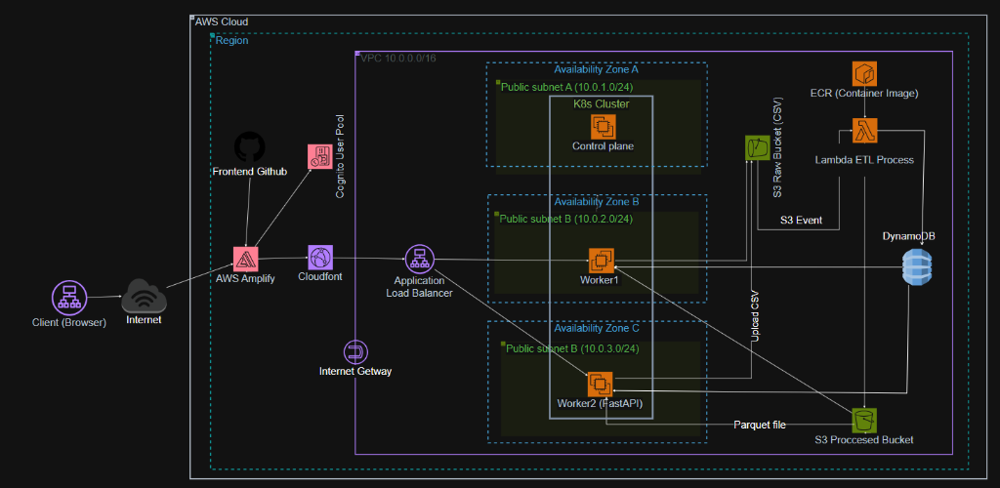

<p align="center">
  <h1 align="center">☁️ ETL SaaS Platform</h1>
  <p align="center">
    A cloud-native, serverless ETL platform built on AWS that automates CSV data ingestion, cleaning, and transformation — delivering analysis-ready Parquet files in seconds.
  </p>
</p>

<p align="center">
  
  
  
  
  
  
</p>

---

## 📋 Table of Contents

- [Overview](#-overview)
- [Architecture](#-architecture)
- [Tech Stack](#-tech-stack)
- [Data Processing Pipeline](#-data-processing-pipeline)
- [Project Structure](#-project-structure)
- [Getting Started](#-getting-started)
- [API Reference](#-api-reference)
- [Deployment](#-deployment)
- [Environment Variables](#-environment-variables)

---

## 🔍 Overview

**ETL SaaS** is a multi-tenant data processing platform where users can:

1. **Upload** raw CSV files through a web dashboard
2. **Automatically process** the data — removing duplicates, handling missing values, detecting outliers
3. **Download** the cleaned result as an optimized Apache Parquet file

The platform is designed with a **serverless-first** approach: the heavy ETL workload runs on AWS Lambda (triggered by S3 events), while the API backend is containerized and orchestrated with a **self-managed Kubernetes cluster** (kubeadm) running on 3 EC2 instances (1 master + 2 worker nodes) across multiple availability zones.

### Key Features

| Feature | Description |
|---------|-------------|
| 🔐 **Authentication** | AWS Cognito User Pool with JWT-based API security |
| 📤 **Drag & Drop Upload** | Browser-based CSV upload with real-time progress tracking |
| ⚡ **Serverless ETL** | AWS Lambda auto-scales to handle any volume of uploads |
| 🧹 **Smart Data Cleaning** | Duplicate removal, null imputation, IQR outlier detection |
| 📊 **Data Preview** | Preview processed data directly in the browser before downloading |
| 📦 **Parquet Output** | Columnar format for 60-80% compression and fast analytics queries |
| 🏗️ **Cloud Infrastructure** | AWS services provisioned and managed via AWS Console |

---

## 🏗 Architecture

<p align="center">
  
</p>


### Components

| Component | Service | Purpose |
|-----------|---------|---------|
| **Frontend** | React + Vite, hosted on AWS Amplify | Dashboard UI with Cognito auth |
| **CDN** | CloudFront | Low-latency content delivery |
| **API Gateway** | Application Load Balancer | Route HTTPS traffic to K8s backend pods |
| **Backend API** | FastAPI on K8s (kubeadm on EC2) | REST API — upload, jobs, download, preview |
| **ETL Engine** | AWS Lambda (container image) | Serverless data processing pipeline |
| **Raw Storage** | S3 (Source Bucket) | Stores uploaded CSV files |
| **Data Lake** | S3 (Processed Bucket) | Stores cleaned Parquet files (Hive-partitioned) |
| **Metadata DB** | DynamoDB | Job tracking and schema registry |
| **Auth** | Cognito User Pool | User registration, login, JWT tokens |
| **Container Registry** | Amazon ECR | Docker images for Lambda + Backend |

---

## 🛠 Tech Stack

### Backend & Processing

| Technology | Version | Purpose |
|------------|---------|---------|
| Python | 3.10 | Core language |
| FastAPI | 0.104 | REST API framework |
| Pandas | 2.1 | Data manipulation & cleaning |
| PyArrow | latest | Parquet read/write engine |
| NumPy | 1.26 | Numerical operations |
| Boto3 | 1.34 | AWS SDK |
| python-jose | 3.3 | JWT validation |

### Frontend

| Technology | Version | Purpose |
|------------|---------|---------|
| React | 19 | UI framework |
| Vite | 7 | Build tool & dev server |
| Tailwind CSS | 3.4 | Utility-first styling |
| AWS Amplify UI | 6.13 | Pre-built Cognito auth components |
| Lucide React | 0.561 | Icon library |

### Infrastructure

| Technology | Purpose |
|------------|---------|
| Kubernetes (kubeadm) | Self-managed K8s on EC2 (1 master + 2 workers) |
| AWS Lambda | Serverless ETL compute |
| Amazon EC2 | Compute for K8s nodes (3 instances) |
| Amazon S3 | Object storage (raw + processed) |
| Amazon DynamoDB | NoSQL metadata store |
| Amazon ECR | Container image registry |
| Amazon Cognito | Identity & access management |
| CloudFront | CDN + HTTPS termination |
| Docker | Containerization |

---

## 🔄 Data Processing Pipeline

The Lambda ETL function applies the following transformations sequentially:

### 1. Extract
- Download CSV from S3 source bucket
- Auto-detect delimiter (`,` `;` `:` `\t` `|`)

### 2. Transform

| Step | Method | Details |
|------|--------|---------|
| **Drop empty rows** | `dropna(how='all')` | Remove rows where all columns are null |
| **Deduplicate** | `drop_duplicates()` | Remove exact duplicate records |
| **Impute numeric nulls** | Median fill | Configurable: median or mean strategy |
| **Impute categorical nulls** | Constant fill | Default: `"Unknown"` (configurable) |
| **Impute datetime nulls** | Forward-fill | Propagate last valid value |
| **Remove outliers** | IQR method | `Q1 - 1.5×IQR` to `Q3 + 1.5×IQR` (configurable multiplier) |
| **Standardize text** | Strip whitespace | Remove leading/trailing spaces |
| **Add metadata** | Audit columns | `_processed_at`, `_source_file` |

### 3. Load
- Convert cleaned DataFrame to **Apache Parquet** (PyArrow engine)
- Upload to data-lake S3 bucket with Hive-style partitioning:
  ```
  processed/user=<uid>/schema=<hash>/date=<YYYY-MM-DD>/<job_id>.parquet
  ```
- Register schema fingerprint in DynamoDB

---

## 📁 Project Structure

```
ETL-Saas/
├── backend/                    # FastAPI REST API (deployed on K8s cluster)
│   ├── app/
│   │   ├── main.py             # FastAPI application & route definitions
│   │   ├── auth.py             # Cognito JWT authentication middleware
│   │   ├── crud.py             # DynamoDB CRUD operations for jobs
│   │   ├── schemas.py          # Pydantic request/response models
│   │   └── config.py           # Environment-based configuration
│   ├── Dockerfile
│   ├── requirements.txt
│   └── .env.example
│
├── lambda/                     # AWS Lambda ETL processor
│   ├── handler.py              # Lambda entry point (orchestrator)
│   ├── etl_processor.py        # Data cleaning & transformation logic
│   ├── s3_io.py                # S3 read (CSV) / write (Parquet)
│   ├── schema_registry.py      # Schema fingerprinting & DynamoDB registry
│   ├── job_tracker.py          # Job lifecycle management
│   ├── config.py               # Environment-based configuration
│   ├── Dockerfile
│   └── requirements.txt
│
├── frontend/                   # React SPA (deployed on AWS Amplify)
│   ├── src/
│   │   ├── main.jsx            # Entry point with Amplify/Cognito config
│   │   ├── App.jsx             # Root component with auth wrapper
│   │   ├── components/
│   │   │   ├── Header.jsx      # Navigation bar with user info
│   │   │   ├── StatsCards.jsx   # Dashboard statistics cards
│   │   │   ├── UploadZone.jsx   # Drag-and-drop CSV upload
│   │   │   ├── JobTable.jsx     # Completed jobs list with download
│   │   │   └── PreviewModal.jsx # Data preview modal
│   │   └── utils/
│   │       └── api.js          # API client with auth token injection
│   ├── package.json
│   └── vite.config.js
│

├── docs/
│   └── architecture.png        # System architecture diagram
│
├── .gitignore
└── README.md
```

---

## 🚀 Getting Started

### Prerequisites

- **AWS CLI** configured with appropriate credentials
- **Docker** (for building container images)
- **kubectl** (for Kubernetes deployments)
- **Node.js** ≥ 18 (for frontend development)
- **Python** ≥ 3.10 (for backend development)

### 1. Provision AWS Resources

Create the following resources via the **AWS Console**:
- **S3**: Source bucket (CSV uploads) + Data Lake bucket (processed Parquet)
- **DynamoDB**: `JobsTable` (partition key: `jobId`) + `SchemaTable` (partition key: `schemaId`)
- **Cognito**: User Pool with email sign-in + App Client
- **ECR**: Repositories for `etl-lambda` and `etl-backend` images
- **EC2**: 3 instances for the Kubernetes cluster (1 master + 2 workers)
- **Lambda**: Container-based function triggered by S3 events

### 2. Build & Push Container Images

```bash
# Authenticate Docker to ECR
aws ecr get-login-password --region ap-southeast-1 | \
  docker login --username AWS --password-stdin <ACCOUNT_ID>.dkr.ecr.ap-southeast-1.amazonaws.com

# Build and push Lambda image
cd lambda
docker build -t etl-lambda .
docker tag etl-lambda:latest <ACCOUNT_ID>.dkr.ecr.ap-southeast-1.amazonaws.com/etl-lambda:latest
docker push <ACCOUNT_ID>.dkr.ecr.ap-southeast-1.amazonaws.com/etl-lambda:latest

# Build and push Backend image
cd ../backend
docker build -t etl-backend .
docker tag etl-backend:latest <ACCOUNT_ID>.dkr.ecr.ap-southeast-1.amazonaws.com/etl-backend:latest
docker push <ACCOUNT_ID>.dkr.ecr.ap-southeast-1.amazonaws.com/etl-backend:latest
```

### 3. Deploy Backend to Kubernetes Cluster

```bash
# SSH into the master node
ssh -i <key.pem> ubuntu@<MASTER_IP>

# Create ConfigMap and Secrets
kubectl create configmap etl-config \
  --from-literal=upload-bucket=<UPLOAD_BUCKET> \
  --from-literal=datalake-bucket=<DATALAKE_BUCKET> \
  --from-literal=jobs-table=<JOBS_TABLE>

kubectl create secret generic etl-secrets \
  --from-literal=cognito-user-pool-id=<USER_POOL_ID> \
  --from-literal=cognito-client-id=<CLIENT_ID>

# Deploy the backend
kubectl apply -f deployment.yaml
kubectl apply -f service.yaml
```

### 4. Run Frontend Locally

```bash
cd frontend
npm install
npm run dev
# → Open http://localhost:5173
```

---

## 📡 API Reference

All endpoints require a valid Cognito JWT in the `Authorization: Bearer <token>` header.

| Method | Endpoint | Description | Response |
|--------|----------|-------------|----------|
| `GET` | `/health` | Health check (no auth) | `{ "status": "ok" }` |
| `POST` | `/api/upload` | Upload CSV file | `{ "job_id": "...", "status": "QUEUED" }` |
| `GET` | `/api/jobs` | List user's jobs | `[{ "jobId", "status", "filename", ... }]` |
| `GET` | `/api/jobs/{id}` | Get job details | `{ "jobId", "status", "metadata", ... }` |
| `GET` | `/api/jobs/{id}/download` | Get Parquet download URL | `{ "download_url": "https://..." }` |
| `GET` | `/api/jobs/{id}/preview` | Preview first 100 rows | `{ "columns", "data", "total_rows", ... }` |

---

## ⚙️ Deployment

### Kubernetes (kubeadm on EC2)

The backend runs on a **self-managed Kubernetes cluster** provisioned with `kubeadm`:

| Node | Role | Availability Zone |
|------|------|--------------------|
| EC2 Instance 1 | Control Plane (master) | AZ-A |
| EC2 Instance 2 | Worker Node | AZ-B |
| EC2 Instance 3 | Worker Node | AZ-C |

- **2 pod replicas** scheduled across the 2 worker nodes
- **Liveness & readiness probes** on `/health`
- **Resource limits**: 500m CPU, 512Mi memory per pod
- **ClusterIP Service** fronted by an Application Load Balancer

### Lambda

The ETL processor runs as a **container-based Lambda function** (up to 1024 MB memory, 5-minute timeout) triggered by S3 `ObjectCreated` events on the `uploads/` prefix.

### Data Lake Partitioning

Processed files are stored in Hive-compatible layout for compatibility with Athena, Spark, and other query engines:

```
s3://data-lake-bucket/
  └── processed/
      └── user=<user_id>/
          └── schema=<schema_hash>/
              └── date=2026-04-23/
                  └── <job_id>.parquet
```

---

## 🔐 Environment Variables

### Backend (`backend/.env.example`)

| Variable | Description | Default |
|----------|-------------|---------|
| `AWS_REGION` | AWS region | `ap-southeast-1` |
| `UPLOAD_BUCKET` | S3 bucket for raw CSV uploads | — |
| `DATALAKE_BUCKET` | S3 bucket for processed Parquet | — |
| `JOBS_TABLE` | DynamoDB table name | `JobsTable` |
| `COGNITO_USER_POOL_ID` | Cognito User Pool ID | — |
| `COGNITO_CLIENT_ID` | Cognito App Client ID | — |
| `CORS_ORIGINS` | Comma-separated allowed origins | `*` |

### Lambda

| Variable | Description | Default |
|----------|-------------|---------|
| `JOBS_TABLE` | DynamoDB jobs table | `JobsTable` |
| `SCHEMA_TABLE` | DynamoDB schema registry table | `SchemaTable` |
| `DATALAKE_BUCKET` | S3 output bucket | — |
| `OUTLIER_IQR_MULTIPLIER` | IQR multiplier for outlier detection | `1.5` |
| `NUMERIC_FILL_STRATEGY` | Missing value strategy: `median` or `mean` | `median` |
| `CATEGORICAL_FILL_VALUE` | Fill value for categorical nulls | `Unknown` |

---

## 📄 License

This project is for educational and portfolio purposes.
